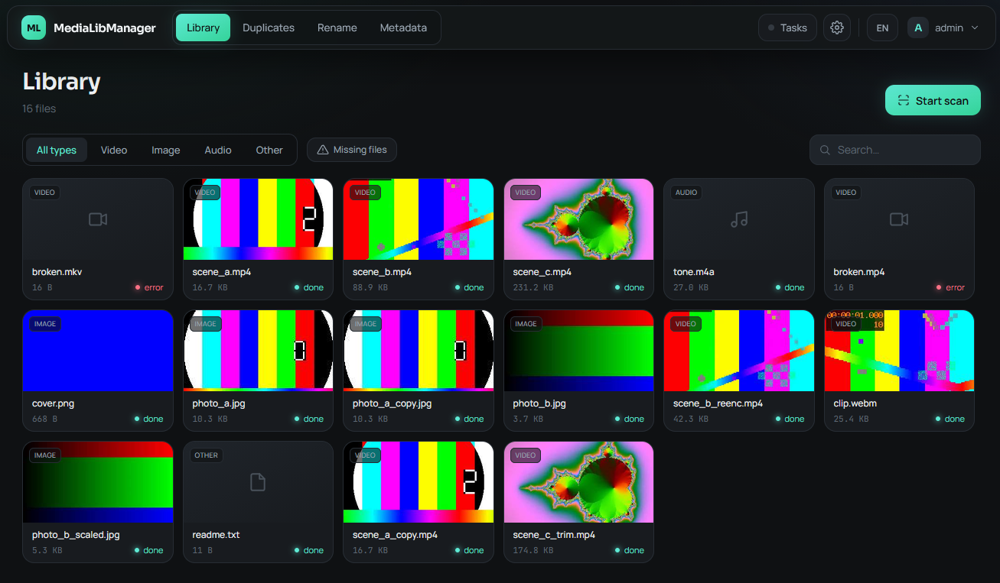
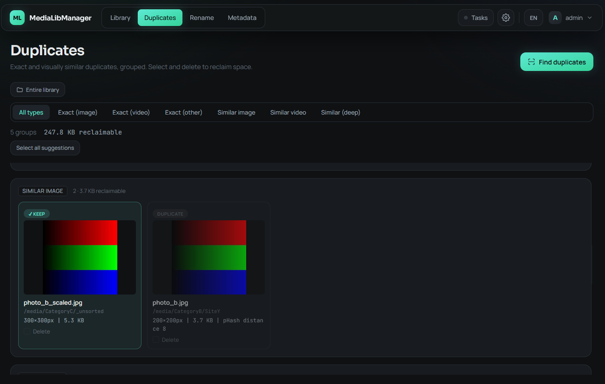
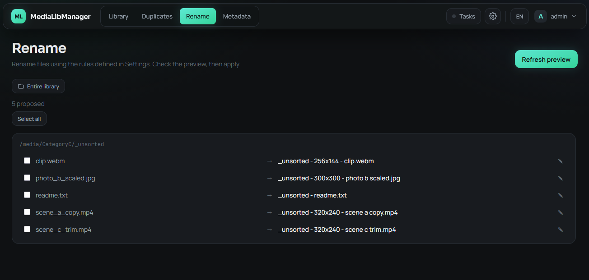
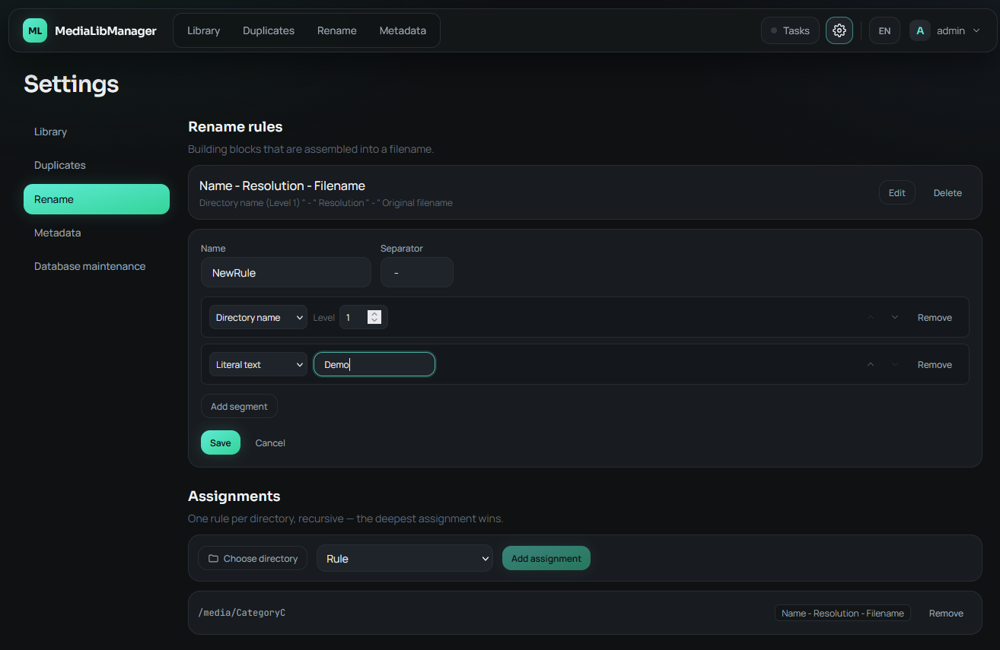
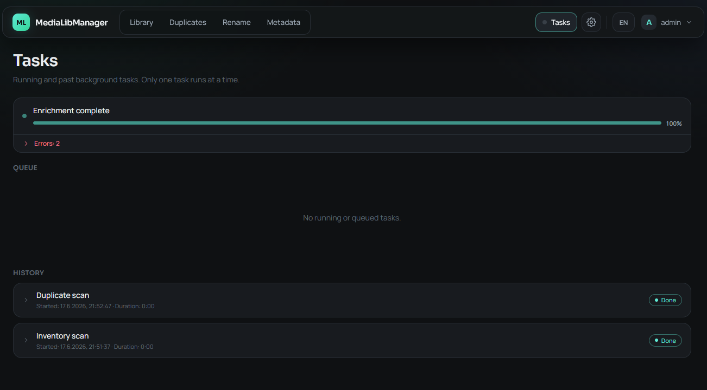
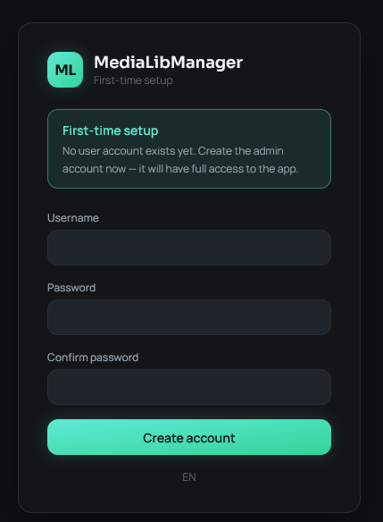

# MediaLibManager

A self-hosted web app to keep a large media library tidy. It combines three jobs that
usually mean three separate tools into one place: **rule-based file renaming**,
**MP4 metadata stripping**, and **duplicate detection** — all backed by a single media
database so a file is only ever inspected once.

[](https://github.com/parcival42/MediaLibManager/actions/workflows/docker-build.yml)
[](LICENSE)

## Features

- **Rule-based renaming** — compose target filenames from building blocks (directory
  name, resolution, duration, the original title with optional cleanup) and assign rules
  per directory. Dry-run preview before anything touches disk; collisions are resolved
  automatically and renames are idempotent.
- **MP4 metadata stripping** — remove embedded Title/Comment atoms, with a backup and a
  multi-stage integrity check (duration + sampled frame hashes) so a strip can never
  silently corrupt a file.
- **Duplicate detection** — four kinds in a single rebuild (strongest first): *exact* (content hash), *visual*
  (image perceptual hash), *video* (sampled-frame hashes), and *deep* (frame-by-frame
  comparison). Results are grouped, with one copy kept per group by default.
- **Two-stage scanning** — a fast inventory pass (stat only) discovers files instantly;
  a background worker then enriches them in cost order (metadata → perceptual hashes →
  deep data), so the library is browsable immediately and gets richer over time.
- **Serial task queue** — renames, strips and deletes run one at a time through a
  SQLite-backed queue that never races the enrichment worker; tasks are cancellable and
  their history is persisted.
- **Scheduled scans** — optional day-of-week / time-of-day automatic inventory scans.
- **Auth & i18n** — session-based login with a first-run setup flow, and a bilingual
  (DE/EN) web UI.

## Screenshots

<table>
  <tr>
    <td width="50%" valign="top"><strong>Library</strong><br/>Fast inventory with type filters and thumbnails.<br/><br/></td>
    <td width="50%" valign="top"><strong>Duplicate detection</strong><br/>Exact &amp; similar matches, grouped, with reclaimable space.<br/><br/></td>
  </tr>
  <tr>
    <td width="50%" valign="top"><strong>Rename — preview</strong><br/>Dry-run of proposed names before anything is applied.<br/><br/></td>
    <td width="50%" valign="top"><strong>Rename — rule editor</strong><br/>Compose filenames from building blocks; assign rules per directory.<br/><br/></td>
  </tr>
  <tr>
    <td width="50%" valign="top"><strong>Tasks</strong><br/>Serial queue with live progress and history.<br/><br/></td>
    <td width="50%" valign="top"><strong>First-run setup</strong><br/>Create the admin account on first launch.<br/><br/></td>
  </tr>
</table>

## Quick start (Docker)

The image is published to GHCR. Create a `docker-compose.yml`:

```yaml
services:
  medialibmanager:
    container_name: medialibmanager
    image: ghcr.io/parcival42/medialibmanager:latest
    ports:
      - "8080:8080"
    volumes:
      - /path/to/your/media:/media   # your media library (read/write)
      - /path/to/your/data:/data     # database + working dir (persisted)
    restart: unless-stopped
    environment:
      # Set a fixed, long random value so sessions survive restarts:
      - AUTH_SECRET=change_me_to_a_long_random_string
```

Then:

```bash
docker compose up -d
```

Open <http://localhost:8080> and create your admin account on first launch.

> Tip: generate a secret with `openssl rand -hex 32`.

## Configuration

Only two settings are environment variables; everything else is edited live on the
**Settings** page and stored in the database.

| Variable | Default | Purpose |
|---|---|---|
| `AUTH_SECRET` | random per start | Signs session cookies. Set a fixed value so logins survive restarts. |
| `MEDIALIB_DATA` | `/data` | Directory for the SQLite database and working files. |

In-app settings include the media root, the duplicate-detection thresholds, the
enrichment worker count, and the scan schedule.

## How it works

The core is a single SQLite database describing every file in the library. A scan never
re-derives what it already knows:

1. **Inventory (stage 0)** — walk the media root, record path/size/mtime. Stat-only, so
   it finishes fast even on a large library.
2. **Enrichment (background)** — a worker advances files one stage at a time, cheapest
   work first: container/metadata, then perceptual hashes (image pHash, sampled video
   frames), then deep frame data used for the strictest duplicate comparison.

Renaming, metadata stripping and duplicate rebuilds are all *pure derivations* over the
enriched rows for previews, and run through the serial task queue when they actually
touch the filesystem.

## Development

```bash
# Backend (FastAPI, dev server on :8080)
cd backend && pip install -r requirements.txt
uvicorn app.main:app --reload --port 8080

# Frontend (Vite dev server, proxies /api to :8080)
cd frontend && npm install && npm run dev
```

A multi-stage `Dockerfile` builds the frontend with Node and serves it from the Python
runtime, which also bundles `ffmpeg`, `exiftool` and `file`.

## Tech stack

- **Backend:** FastAPI (Python), SQLite, ffmpeg / exiftool / imagehash.
- **Frontend:** React + Vite + TypeScript + Tailwind CSS.
- **Packaging:** single multi-stage Docker image, published to GHCR via GitHub Actions.

## License

[MIT](LICENSE)
